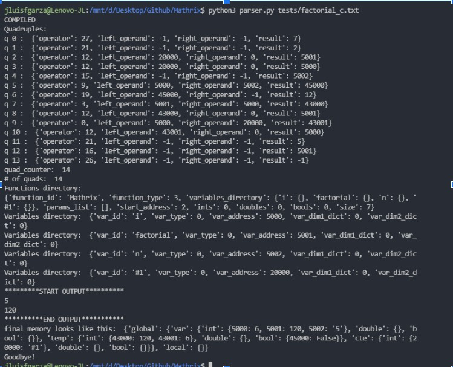
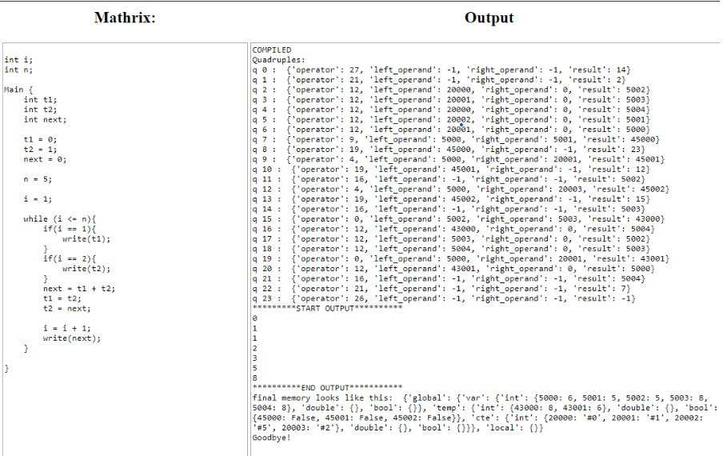

# Mathrix

Compiler Design course project

##Manual de Usuario

#### Estructura

Las variables globales pueden ser declaradas fuera de la función Main o dentro del Main, pero siempre deben ir primero la declaración de variables antes que la declaración de funciones.

```
int i;
int n;
int ans;
int aux;

function int fib(int x){
    if(x == 0){
        return (0);
    }
    if(x == 1){
        return (1);
    }
    else{
        return (fib(x - 1) + fib(x - 2));
    }
}
Main {
    i = 0;
    n = 0;
    ans = 0;
    aux = 0;

    read(n);

    ans = fib(n);
    write(ans);
}
```

#### Declaración de Variables

Las variables deben ser declaradas primero antes de poder asignarles un valor. Existen varios tipos de dato: enteros (int), decimales (double) y booleanos (bool). Se pueden declarar matrices anteponiendo la palabra matrix seguido del id de la matriz y de cuántos renglones y columnas se desean. Para inicializar o meter datos a una matriz, se hace mediante la asignación de enteros dentro de una lista por renglón dentro de llaves para agrupar renglones. Es importante que a todas las variables se les asigne un valor inicial, antes de que se utilicen en alguna expresión o estatuto.

```
int n;
double  d;
n = 2;
d = 2.02;
matrix int m[6][0];
matrix arr = {[7,4,3,6,1,5],[]};
matrix int n[1][1];
matrix m = {[1,2],[3,4]};

Declaración de Funciones
Las funciones deben declararse anteponiendo la palabra ‘function’ seguido del tipo de retorno (int, double o void), después se escriben sus parámetros, también especificando el tipo y el nombre. Los parámetros serán variables locales dentro de la función.

function int fact(int x){
    if(x < 1){
        return (1);
    }
    else{
        return (fact(x - 1) * x);
    }
}
```

#### Funciones propias del lenguaje

Puedes realizar operaciones sobre las matrices que declares, sin necesidad de hacer ciclos, por ejemplo:
Sumar un entero a la matriz
Restar un entero a la matriz
Multiplicar por un entero la matriz
Imprimir su contenido
También, puedes intercambiar valores de variables.

```
matrix int m[1][1];
int i;
int j;

Main{
    i = 0;
    matrix m = {[1,1],[1,1]};
    while(i < 2){
        j = 0;
        while(j <2){
            write(m[i][j]);
            j = j + 1;
        }
        i = i + 1;
    }
    write(1010101010101);

    multiply_matrix(m, 3);
    i=0;
    while(i < 2){
        j = 0;
        while(j <2){
            write(m[i][j]);
            j = j + 1;
        }
        i = i + 1;
    }

    write(1010101010101);
    add_to_matrix(m, 2);
    i=0;
    while(i < 2){
        j = 0;
        while(j <2){
            write(m[i][j]);
            j = j + 1;
        }
        i = i + 1;
    }

    write(1010101010101);
    i = 5;
    j = 0;
    write(i);
    write(j);
    swap(i,j);
    write(i);
    write(j);

    write(1010101010101);
    subtract_from_matrix(m, 4);
    i=0;
    while(i < 2){
        j = 0;
        while(j <2){
            write(m[i][j]);
            j = j + 1;
        }
        i = i + 1;
    }
    write(1010101010101);
    p_matrix(m);
}
```

#### Condiciones

Nos basamos en una sintaxis muy parecida a CPP por lo que
las condiciones tienen la misma sintaxis.

```
if(x < 1){
        return (1);
    }
    else{
        return (fact(x - 1) * x);
    }
```

#### Ciclos

Contamos con el ciclo while con una sintaxis similar a CPP

```
while (i <= n){
        ans = fact(i);
        i = i + 1;
}
```

Instrucción para ejecutar código:
python parser.py NOMBRE_ARCHIVO.TXT

Ejemplo:

UI over APACHE server

Ejemplo:



## APACHE Web UI

INIT:

- Install XAMPP
- Install Python 3
- Modify Apache server config

  > ADD FOLLOWING LINES AT END OF httpd.conf
  >
  > ```
  > AddHandler cgi-script .py
  > ScriptInterpreterSource Registry-Strict
  > ```

  > Moddify IfModule dir_module
  >
  > ```
  > <IfModule dir_module>
  >   DirectoryIndex index.php index.pl index.cgi index.asp index.shtml index.html >index.htm \
  >   default.php default.pl default.cgi default.asp default.shtml default.html >default.htm \
  >   home.php home.pl home.cgi home.asp home.shtml home.html home.htm index.py
  > </IfModule>
  > ```

- `$ sudo pip install numpy scipy`
- `$ sudo pip install fastnumbers`

# Run

Put `server` directory inside `C:\xampp\htdocs\python`

To run files on server please start the apache server on XAMPP then open any .py file on the following url:
`http://localhost/python/mathrix/server/`

Ejemplo:


